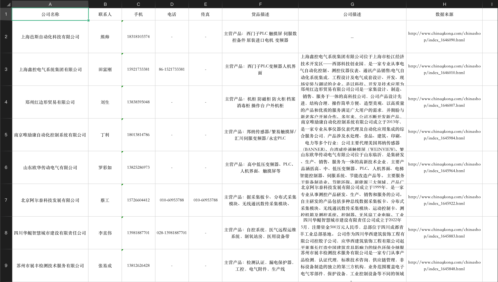

# 安装插件

该插件依赖[sunday](https://github.com/pysunday/pysunday), 需要先安装sunday

执行sunday安装目录：`sunday_install tools-chinagkong`

## huicong命令使用

```bash
 $ chinagkong -h

usage: chinagkong [-t TYPENAME] [-l] [-r RANGE] [-T THREAD_NUM] [-v] [-h] [--loglevel LEVEL]

工控信息网供应商信息采集

Optional:
  -t TYPENAME, --type TYPENAME        类型
  -l, --list                          全部类型
  -r RANGE, --range RANGE             采集范围
  -T THREAD_NUM, --thread THREAD_NUM  线程数
  -v, --version                       当前程序版本
  -h, --help                          打印帮助说明
  --loglevel LEVEL                    日志等级（notset、debug、info、warning、error、critical）, 默认debug

使用案例:
    chinagkong -l
    chinagkong -t 电线电缆 -T 20
    chinagkong -T 10

 usage: huicong [-v] [-h] [-t TYPENAME] [-l] [-r RANGE]
```

## 数据结果


